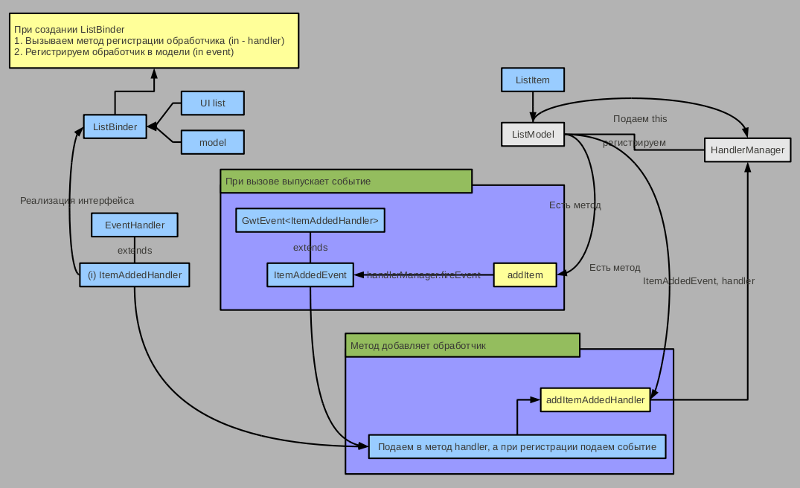
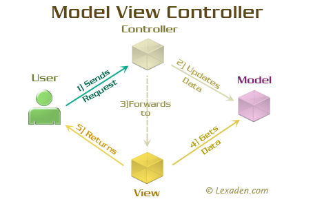
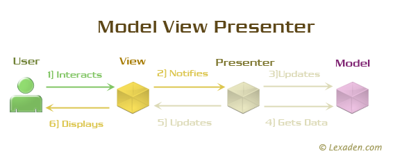
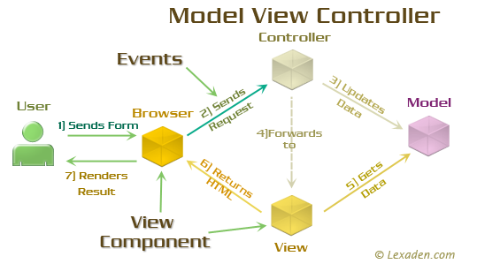
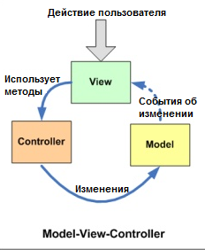
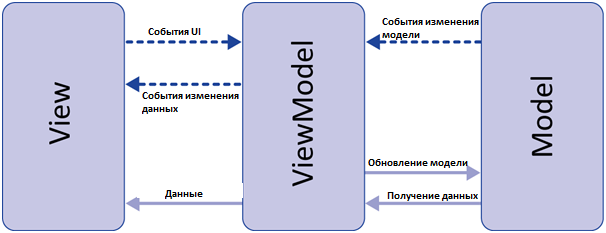

* `Введение в MVP GWT 2.1`: [habrahabr.ru/post/113121](http://habrahabr.ru/post/113121/) **(** [mvpinaction](http://code.google.com/p/mvpinaction/source/browse/) **)** >> [127.0.0.1:8888/index.html](http://127.0.0.1:8888/index.html)
* `Model-View-Presenter`: **[MVP](https://ru.wikipedia.org/wiki/Model-View-Presenter)** шаблон проектирования, производный от **[MVC](https://ru.wikipedia.org/wiki/Model-View-Controller)**, который используется в основном для построения пользовательского интерфейса

> "Виджет" обладает такими функциональными качествами как:
- отображение данных;
- обмен данными (получить/отправить);
- реагирование на действие пользователя (...);

> "Страница" обладает такими функциональными качествами как:
- привязка к URL-адрессу;
- передача/хождение по HTTP-протоколу...;
- хранение пользовательского состояния на странице...;

> "Контролер" обладает такими функциональными качествами как:
- (работает только с фронтальными клиентскими запросами...)
- получает информацию о клиентском запросе...;
- переключается между страницами ... организовывает навигацию по страницам - постраничный переход;
= его основная задача это централизированное управление компонентами (моделью и видом + привязка страниц к URL)...

> "Страница" связывается с "Виджетом" с помощью "Active"-объекта/класса (который передает данные...);

Хорошим тоном программирования является использование класса-фабрики который в последствии возвращает будет возвращать актуальную версию реализации классов...
> 'ClientFactoryImpl'

...для автоматической генерации реализации интерфейса при вызове метода 'GWT.create(Class)'

===================================================================================================================================================
** (Введение в MVP GWT 2.1) http://habrahabr.ru/post/113121/
** (Блог татарина-программиста ** [GWT] Activities And Places (Вольный перевод)) http://gshmalik.blogspot.com/2014/11/gwt-activities-and-places.html
** (Блог татарина-программиста ** [GWT] Building MVP apps: MVP Part I (Вольный перевод)) http://gshmalik.blogspot.com/2015/06/building-mvp-apps-mvp-part-i.html
** (Блог татарина-программиста ** [GWT] Building MVP apps: MVP Part II (Вольный перевод)) http://gshmalik.blogspot.com/2015/08/gwt-building-mvp-apps-mvp-part-ii.html

*  (GWT + mvp4g: лэйауты, порталы, портлеты) http://shamansir.github.io/gwt-mvp4g-layouting-demo/index-ru.html
   (Тестирование GWT приложений архитектуры MVP) http://habrahabr.ru/post/246285/
   http://kgiu.kz/wp-content/plugins/spoilers/import/?http%3A%2F%2Fkgiu.kz%2Fwp-content%2Fplugins%2Ffeedgrubber%2Fimport%2Ffrozen%3Fhttp%3A%2F%2Fhabrahabr.ru%2Frss%2Fblogs%2Fgwt%2F
*  (GWT Development with Activities and Places) http://webcentersuite.blogspot.com/2011/08/gwt-development-with-activities-and.html
*  (Managing GWT History and Hyperlinks Tutorial) http://developerlife.com/tutorials/?p=232

(Java Web Application Developer) https://moikrug.ru/vacancies/933440495

---------------------------------------------------------------------------------------------------------------------------------------------------
* `[GWT] Activities And Places (Вольный перевод)`: [gshmalik.blogspot.com/2014/11/gwt-activities-and-places](http://gshmalik.blogspot.com/2014/11/gwt-activities-and-places.html)
>1) GWT 2.1 представила встроенный framework для управления историей в браузере.
>   Activities and Places framework позволяет вам создавать URL с метками в вашем приложении, тем самым позволяя кнопке «назад» и закладкам в браузере работать так, как от них ожидают пользователи. 
>
>2) GWT 2.1 ввел интерфейс IsWidget, который реализуют большинство Widget’ов так же, как Composite.
>
>3) Для того чтобы быть доступным через URL, Activity нужен соответствующий Place.
>   Place должен иметь связанный PlaceTokenizer, который знает как сериализовать состояние Place в маркер URL...
>

* `Введение в MVP GWT 2.1`: [habrahabr.ru/post/113121](http://habrahabr.ru/post/113121/)
>0) В MVP принято “обмениваться” между презентером и видом только интерфейсами.
>   Поэтому для каждого вида в приложении есть соответствующий интерфейс.
>
>1) Логика страниц (видов) или Activity.
>   При кликах на этих ссылка выполняется переключение между видами...
>
>2.1) Как это работает:
>     ActivityManager следит за всеми Activities, которые функционируют в контексте одного контейнер-виджета. Он отлавливает событие PlaceChangeRequestEvent и сообщает текущему Activity о смене Place.
>     ActivityManager при получении события изменения URL от PlaceHistoryManager создает с помощью ActivityMapper-а нужный инстанс Activity и запускает ее на выполнение с помощью метода start().
>     Помимо ActivityManager, есть два других GWT класса так же работающих с Place:
>     1. PlaceController отвечает за смену Place, а так же уведомление пользователя, прежде чем это (сменить Place) сделать.
>     2. PlaceHistoryHandler позволяет определять Place по URL и наоборот.
>   .. Всякий раз, когда приложение переходит в новый Place, обновляется URL с новыми токенами хранящимися в этом Place, так появляется возможность делать закладки, а так же пользоваться механизмом истории в браузере. (Таким же образом, когда пользователь нажмет кнопку «назад» или же перейдет на закладку, PlaceHistoryHandler позволит загрузиться вашему приложению c соответствующим Place.)
>
>2.2) Как перемещаться:
>     Для перехода на новый Place можно использовать метод goTo() экземпляра PlaceController...
>     PlaceController оповещает текущее Activity о том, что оно может быть остановлено (через событие PlaceChangeRequestEvent).
>     Если остановка Activity разрешается, то выстреливается событие PlaceChangeEvent/ValueChangeEvent с информацией о новой Place.
>     PlaceHistoryHandler ловит событие PlaceChangeEvents и обновляет историю токенов URL.
>     ActivityManager так же слушает события PlaceChangeEvent. При помощи ActivityMapper он определяет Activity советующий Place’у. (Затем ActivityManager запускает это Activity)
>     Когда пользователь переходит в новый URL (через гиперссылку, кнопку «назад» или закладку), PlaceHistoryHandler ловит событие ValueChangeEvent с объекта History и вызывает PlaceHistoryMapper для преобразования токена истории в соответствующий Place. Затем вызывается PlaceController.goTo() с новым Place.
>
>3) Place или хеш-URL’ы и их обработка:
>   объект Place отвечает за текущее состояние UI.
>   Состояние передается с помощью URL посредством history-токенов. По сути в этом объекте можно хранить параметры, которые передаются с хэш-URL’ой. Состояние URL кодируется/декодируется с помощью объекта Tokenizer’а.
>
>4) Определение нужной Activity и регистрация обработчиков:
>   При поступлении новой URL и успешной инстанциации объекта Place менеджер ActivityManager с помощью ActivityMapper’а принимает решение о том, какой объект презентера нужно запустить.
>
>5) Регистрация обработчиков хэш-URL’ов, т.е. токенайзеров выполняется в интерфейсе PlaceHistoryMapper.
>   Все что нужно на данном этапе это просто перечислить в аннотации @WithTokenizers классы токенайзеров приложения.
>

Чтобы встроенный MVP-фреймворк заработал нужно подключить соответствующие GWT-модули в файле описания GWT-модуля (gwt.xml-файл)
открыть ту или иную подсистему можно просто набрав в адресной строке браузера корректную URL. Автоматически будет запущен процесс преобразования состояния из URL в соответствующий place с запуском соответствующей activity, которая и отобразит нужный нам вид.

Весь код по инициализации и запуску механизма MVP-фреймворка собран в onModuleLoad()-методе EntryPoint’а

---------------------------------------------------------------------------------------------------------------------------------------------------
* `[GWT] Activities And Places (Вольный перевод)`: [gshmalik.blogspot.com/2014/11/gwt-activities-and-places](http://gshmalik.blogspot.com/2014/11/gwt-activities-and-places.html)
* `Введение в MVP GWT 2.1`: [habrahabr.ru/post/113121](http://habrahabr.ru/post/113121/)
* `Разработка GWT приложения с использованием MVP и Mvp4G`: [dmitrynikol.blogspot.com/2011/08/gwt-mvp-mvp4g](http://dmitrynikol.blogspot.com/2011/08/gwt-mvp-mvp4g.html)
>
>     GWT 2.1 ввел интерфейс IsWidget, который реализуют большинство Widget’ов так же, как Composite.
>
>     Place должен иметь связанный PlaceTokenizer, который знает как сериализовать состояние Place в маркер URL...
>     Когда пользователь переходит в новый URL (через гиперссылку, кнопку «назад» или закладку), PlaceHistoryHandler ловит событие ValueChangeEvent с объекта History и вызывает PlaceHistoryMapper для преобразования токена истории в соответствующий Place.
>>    2. PlaceHistoryHandler позволяет определять Place по URL и наоборот.
>     Затем вызывается PlaceController.goTo() с новым Place.
>>    1. PlaceController отвечает за смену Place, а так же уведомление пользователя, прежде чем это (сменить Place) сделать.
>
>     ActivityManager при получении события изменения URL от PlaceHistoryMapper создает с помощью ActivityMapper-а нужный инстанс Activity и запускает ее на выполнение с помощью метода start().
>   .. Всякий раз, когда приложение переходит в новый Place, обновляется URL с новыми токенами хранящимися в этом Place, так появляется возможность делать закладки, а так же пользоваться механизмом истории в браузере. (Таким же образом, когда пользователь нажмет кнопку «назад» или же перейдет на закладку, PlaceHistoryHandler позволит загрузиться вашему приложению c соответствующим Place.)
>
>     ActivityManager так же слушает события PlaceChangeEvent. При помощи ActivityMapper он определяет Activity советующий Place’у. (Затем ActivityManager запускает это Activity)
>     Логика страниц (видов) или Activity. При кликах на этих ссылка выполняется переключение между видами...
>
>     объект Place отвечает за текущее состояние UI.
>     Состояние передается с помощью URL посредством history-токенов. По сути в этом объекте можно хранить параметры, которые передаются с хэш-URL’ой. Состояние URL кодируется/декодируется с помощью объекта Tokenizer’а.
>
>     Для перехода на новый Place можно использовать метод goTo() экземпляра PlaceController...
>     PlaceController оповещает текущее Activity о том, что оно может быть остановлено (через событие PlaceChangeRequestEvent).
>     Если остановка Activity разрешается, то выстреливается событие PlaceChangeEvent/ValueChangeEvent с информацией о новой Place.
>     PlaceHistoryHandler ловит событие PlaceChangeEvents и обновляет историю токенов URL.
>     ActivityManager так же слушает события PlaceChangeEvent. При помощи ActivityMapper он определяет Activity советующий Place’у. (Затем ActivityManager запускает это Activity)
>
>     EventBus похож на командный центр, который связывает вместе все остальные части.
>     Основная его идея в том, что другие части не знают о друг друге и могут работать независимо в свободно связанной форме. Что в свою очередь означает, что мы получаем защищенное, поддерживаемое и масштабируемое решение.
>     EventBus является очень важной частью, так как в приложении выступает в качестве точки входа.
>

---------------------------------------------------------------------------------------------------------------------------------------------------
** `Разработка GWT приложения с использованием MVP и Mvp4G`: http://dmitrynikol.blogspot.com/2011/08/gwt-mvp-mvp4g.html
*  `MVP/Event bus framework for GWT`: http://mvp4g.blogspot.com/
*  `GWT architecture`: https://confluence.jetbrains.com/display/~link/GWT+architecture
*  `GWT Tutorials: Google Web Toolkit`: http://easylearntutorial.com/series/watch/37/gwt-tutorials-google-web-toolkit
** `GWT MVP4G eventBus и классы`: http://javatalks.ru/topics/26177
** `Creating and handling GWT сustom events`: http://dmitrynikol.blogspot.com/2012/06/gwt-ustom-events.html
   ``: http://www.methodsandtools.com/archive/gwtgooglewebtoolkit.php

Дело в том что объект 'Place' - является (не просто абстрактым) супер-абстрактным!
Это по сути какой-то некий-абстракный контейнер, объект которого закеширован внутри реестра 'PlaceHistoryMapper'.
Ключем доступа к этому абстракному контейнеру является его URL-фрагмент (ссылка).

Итак, ключевым элементом для доступа к 'Place' являеться URL-фрагмент (ссылка).
- такой URL-фрагмент (ссылка) сперва регистрруется для 'Tokenizer' (внутри объекта 'Place'... и в последствии попадает в реестр 'PlaceHistoryMapper');
- потом такая же ссылка регистрируется в 'Activity'

'PlaceHistoryMapper' - ложит... (преобразует 'Place' в URL-фрагимент)
'DOM' - извлекает... ('AbstractActivity'>>'ActivityMapper')
Теперь чтобы как-то связать между собой 2-е части: 'PlaceHistoryMapper' и 'ActivityMapper' с помощью 'Place', здесь используется - 'EventBus'.

1) Дело в том, что 'Place' это такой абстрактный контейнер, к которому применяется правило истории..., то-есть, для каждого абстрактного контейнера строиться уникальная история доступа к этому элементу. Такая истори доступа храниться в 'PlaceHistoryMapper'.
>>>
События которые изменяют состояние этой истории приходят-поступают из 'PlaceHistoryHandler'>>'PlaceController'...

2) Чтобы найти и вытащить элемент (абстрактный контейнер) 'Place' из этой истории - для этого используется 'DOM' ('AbstractActivity'>>'ActivityMapper')...
>>>
('PlaceController' ходит-перебирает URL-фрагимент по истории...)

А дальше происходит <магия>:
- часть-1 (PlaceHistoryMapper-история) с частью-2 (ActivityMapper-логика-виджета) связываются между собой через объект 'Place' (URL-фрагмент) НЕявным (скрытым) способом с помощью механизма 'EventBus'.
- в действительности-же класс-'EventBus' проделывает внутри сложные манипуляции... Дело в том, что часть-1 (PlaceHistoryMapper-история) и часть-2 (ActivityMapper-логика-виджета) работают совсем по разному И чтобы они независили друг от друга - 'EventBus' разделяет между ними зоны ответственности и предоставляет способ независимой связи между ними.

GWT Activities и Places (составляющие встроенного MVP)
======================================================
=================================================================[ Клиентская схема GWT-MVP ]======================================================
Есть веб-браузер. В веб-браузере есть:
- клиентское поле (передает/отображает клиентские данные с помощью <виджетов>);
- и адресная строка (используется для перехода между веб-страницами);

Центральным компонентом 'GWT MVP' является класс для хранения истории досту к веб-страницам - 'PlaceHistoryMapper';
Внутри 'PlaceHistoryMapper' реализована некая сложная схема/структура которая формирует таблицу истории доступа к веб-страницам... и оперирует элементом(ми) (объект) типа 'Place'.
'Place' - это такой тип данных, который представляет собой некий абстрактный контейнер (там внутри храниться данные о состоянии веб-страницы). Получить доступ к этому элементу 'Place', который храниться в таблице истории доступа к веб-страницам внутри 'PlaceHistoryMapper', и вытащить данные о состоянии веб-страницы можно с помощю URL-фрагмента (ключа) - 'Tokenizer'.

<Виджет> - это клиентский элемент, который:
- может отобразить клиентские данные;
- может обмениваться клиентскими данными (между обработчиком...);
- может реагировать на клиентские действия/события...;
<Виджет> является источником данных (клиентское поле веб-страницы), который непосредственно взаимодействует с клиентом...

Дальше эти данные, о состоянии веб-страницы, хранит объект типа 'Place' в таблице истории доступа к веб-страницам.
Чтобы передать данные о состоянии страницы, из объекта типа <Виджета> в объект типа 'Place' нужно конвертировать эти данные о состоянии страницы в URL-фрагмент (потому-что именно через (ключ) URL-фрагмент можно получить доступ к элементу 'Place' внутри таблицы истории доступа к веб-страницам 'PlaceHistoryMapper').
'Activity' - делает конвертацию данных о состоянии страницы в URL-фрагмент из <Виджета> в 'Place' и наоборот (из 'Place' в <Виджет>).

Когда, в каких случаях, и в каком направлении нужно передавать эти данные о состоянии страницы (URL-фрагмента): либо из <Виджета> в 'Place', либо наоборот (из 'Place' в <Виджет>) - то-бишь в одном случае данные из <виджета> о состоянии веб-страницы нужно сохранять в истории доступа к веб-страницам, а в другом случае данные о состоянии веб-страницы нужно вытягивать из истории доступа к веб-страницам и отображать в <виджете>...
Этот процесс (направление запись/извлечение) контролируется с помощью - 'EventBus'.

= = = = = = = = = = = = = = = = = = = = = = = = = = = = = = = = =[ Клиентская схема GWT-MVP ] = = = = = = = = = = = = = = = = = = = = = = = = = = =
Итак, из этой схемы выделяется 3-и ключевых компонента:
1) 'Activity' ............. <вид> (отвечает за отображение данных...)
2) 'PlaceHistoryMapper' ... <модель> (место хранения данных...)
3) 'EventBus' ............. <контролер> (объединяет в себе все составляющие компонеты схемы...)

Теперь для объединения 3-х ключевых компонентов ('PlaceHistoryMapper'+'EventBus'+'Activity') из этой схемы используется MVP-фреймворк (аналог MVC):
* в приложении существует много разных Activity(s). Чтобы в конкретной ситуации использовать/выбрать требуемый тип - это делает (фабрика) 'ActivityMapper';
* Чтобы запустить нужную команду для передачи данных... - это делает (интерфейс) 'ActivityManager';

====================================================================[ Обработчик событий ]=========================================================
* `Creating and handling GWT сustom events`: http://dmitrynikol.blogspot.com/2012/06/gwt-ustom-events.html

Стандартный подход к реализации обработчика событий:
- (Что такое событие) события бывают разных типов, например - клик по кнопке, разворачивание выпадающего списка, переключение радио-кнопок,...;
- Слушатель события - прослушивает состояние системы и, по факту наличия указанного типа события, передает это событие методу-обработчику;

Но в реальности:
* за обработку событий обычно отвечает - (некий) веб-сервис;
* иннициатором (источником) события - является виджет (клиентский интерфейс);

Управлять историей для просмотра (прошлого) состояния веб-страниц можно через адрессную строку в веб-браузере:
* 'PlaceHistoryHandler' - слушает и обрабатывает события адрессной строки из веб-браузера;
* 'PlaceController' - переходит на другой тип (объекта) 'Place' (...);

(Аннотация) '@WithTokenizers' - регистрирует/добавляет новый элемент 'Place' в (таблицу истории доступа к веб-страницам) 'PlaceHistoryMapper'
Чтобы зарегистрировать/добавить новый элемент 'Place' в (таблицу истории доступа к веб-страницам) 'PlaceHistoryMapper' нужно соблюдать правила:
* в кастомерском классе-Place 'Place' должен иметь связанный 'PlaceTokenizer' который знает как сериализовать состояние Place в (маркер) URL-фрагмент...

= = = = = = = = = = = = = = = = = = = = = = = = = = = = = = = = = = [ Обработчик событий ]= = = = = = = = = = = = = = = = = = = = = = = = = = = = =
В больших приложениях, где много разных сервисов, модулей... требуется модель согласованного и гарантированного способа для реализации обработчика событий.
И это реализованно через шаблон:
* Форма представления события - (что отправлять - как должны выглядеть события) это есть некий интерфейс-обработчика метоты которого вызываются внутри виджета при наличии какого-то события;
* Класс-обработчика - (кто получает события - получатели = это подписчик, объекты которые хотят получать события должны зарегистрировать себя как заинтересованные в событиях) желает получить событие и для этого реализует интерфейс-обработчика;
* Виджет - (кто отправляет события - отправители/источник) принимает ссылку на класс-обработчик события И имеет методы которые вызывает при событии;

++++++++++++++++++++++++++++++++++++++++++++++++++++++++++++++++++++[ Обработчик событий ]+++++++++++++++++++++++++++++++++++++++++++++++++++++++++
Для релизации модели события нужно знать следующее:
* Существует некий класс-объект который отвечает за управление обработчиками событий (какой-нибудь Handler: 'HandlerManager', 'PlaceHistoryHandler')...
  В этом классе (объекте) содержутся (формы представления событий - что отправлять) типы интерфейсов-обработчиков метоты которых вызываются внутри виджета при наличии какого-то события;
* Нужно зарегистрирвать (класс) обработчика события (например: 'PlaceController') через этот 'Handler';
* И дальше нужно иннициализировать событие (например метод: 'fireEvent(..)', 'start(..)' - в Avtivity);

Для веб-приложения быают 2-а вида событий:
1. Клиентские события - которые приходят от клиентского поля (виджетов: кнопки, радио-кнопки, выпадающие списки)...
2. События истории - которые приходят от адрессной строки при переходе между страницами (образуют историю доступа к веб-страницам)...;

+ + + + + + + + + + + + + + + + + + + + + + + + + + + + + + + + + + [ Обработчик событий ]+ + + + + + + + + + + + + + + + + + + + + + + + + + + + +
http://habrahabr.ru/post/113121

   <виджет> - (это элемент клиентского интерфейса) является источником события (отправители)...
* 'Activity' - (является обверткой для <виджета>) предназначен для конвертации (в URL-фрагмент) и передачи данных между <виджетом> и 'Place'.
               То есть, 'Activity' является так сказать вторичным источником события (посредником)...
* 'Place' - (это сервис истории доступа к веб-страницам, который возвращает состояние веб-страницы) является классом-обработчиком события (подписчик)...
* 'EventBus' - (абстрактный контролер - шлюз для обмена событиями) это центральный элементом который собирает/накапливает/хранит внутри себя разные события...

Итак, из этой схемы модели события выделяется 2-а ключевых компонента:
* 'ActivityMapper' - регистрирует классы-объекты типа 'Activity', которые являются источником клиентского события (отправителей для клиентских событий...виджетов)
* 'PlaceHistoryMapper' - регистрирует классы-объекты типа 'Place', которые являются обработчиком события истории (подписчиков для события истории...адрессной строки)

( 'ActivityMapper' и 'PlaceHistoryMapper' - это 2-е разные/независимые части приложения, которые держут (зарегистрированные) классы-обработчики-источником... Чтобы передать данные между ними используется - 'EventBus' )
( А чтобы события попали в эти классы-обработчики-источники ('ActivityMapper','PlaceHistoryMapper') через 'EventBus' - для этого используются 'PlaceHistoryHandler' и 'ActivityManager' )
Теперь чтобы данные о событиях попали в шлюз для обмена событиями 'EventBus' это нужно проиннициализировать...:
* 'PlaceHistoryHandler' - является источником события (отправителей для события истории...адрессной строки).
                          (Поскольку классы-обработчики события истории уже зарегистрированы через 'PlaceHistoryMapper') теперь чтобы иннициализировать источники события истории используется функция - '<PlaceHistoryHandler>.register(..)' 
* Функция '<ActivityManager>.start(..)' через Avtivity - иннициализируем источники клиентского события (отправителей для клиентских событий...виджетов)

Резюме:
- 'EventBus' используется в том случае когда GWT-приложение имеет источник-события и обработчик-события...
- В том случае когда GWT-приложение разрастается и имеет больше 1-ой веб-страницы (много веб-страниц) чтобы обеспечить/гарантировать надежную работу для обработки всех веб-страниц применяется модель событий...и можно использовать 'EventBus'
  Потому-что 'EventBus' является централизированным элементом, который облегчает работу для реализации сложной событийной модели...

====================================================================[ Обработчик событий ]=========================================================
Итак, в GWT-приложении существует 2-вида событий:
1. Клиентские события - которые приходят от виджетов в клиентском поле веб-страницы (такие клиентские события являются обычным стандартным явлением в любом GUI-приложении);
2. События истории - которые приходят от адрессной строки веб-браузера (такие события истории являются особенностью веб-приложения, которые позволяют перемещаться по истории посещаемости веб-страницы... - это аналог СЕССИИ, технология 'SESSION-BEAN').
( Поэтому чтобы в GWT-приложении поддерживать работу с СЕССИИЯМИ существует отдельный компонент - обработчик события истории );

Реализация событий истории И клиентских событий в GWT-приложении выполняется аналогично:
- первым делом регистрируются классы-обработчиков событий...
- потом выполняется иннициализация отправителей событий...

В GWT есть составляющие встроенного MVP (то есть, это еще не модель MVP-паттерна, только встроенная его поддержка...)
* 'EventBus' - (шлюз для обмена событиями) представляет собой некий абстрактный контролер, задача которого в том чтобы облегчить реализацию и работу с MVP-паттерном для разработчика (то есть, большую часть работы: как контролер, как модель событий - выполняет 'EventBus')...
  То есть 'EventBus' являеться вспомогательным классом (конечно можно обойтись и без него...)

 Модель обработчика событий позволяет разделять схему на независимые части-блоки...
Каждая его часть-блок отвечает только (исключительно) за свою часть работы И ничего незнает о существовании других частей-блок модели обработчика событий.
 Итак, создаем модель схемы события
 1-шаг:
 - определяем тип события (интерфейс 'EventHandler');
 - создаем заинтересованных получателей-подписчиков (обработчиков событий 'GwtEvent');
 - создаем источник-издатель события (система отправки событий 'HasHandlers');
 2-шаг:
 - регистрируем заинтересованных получателей-подписчиков (обработчиков событий) для источника-издателя события (метод 'addHandler(<EventHandler>)');
 - реализуем метод который будет выбрасывать событие ('fireEvent(<GwtEvent>)') для отправки сообщений подписчику;
 3-шаг:
 - вешаем/добавляем обработчиков событий (подписчиков) на <виджет> (который будет отображать результаты обработчиков событий);
Собираются/связываются все эти независимые части-блоки в (одном месте) контроллере.

* `(#1 ...BrowserHistory3e...)`  http://developerlife.com/tutorials/?p=232
* `(#2 ...CustomGwtEvents3e...)` http://dmitrynikol.blogspot.com/2012/06/gwt-ustom-events.html
* `(#3 ...Good-bye...)`          http://gshmalik.blogspot.com/2014/11/gwt-activities-and-places.html

0. (Удаленные процедуры в GWT) http://bigbelk.users.sourceforge.net/articles/prog_rpc.html

1. GWT Activities и Places (составляющие встроенного MVP)
   ------------------------------------------------------
   * (Tutorial - Managing GWT History and Hyperlinks) http://developerlife.com/tutorials/?p=232
   * (Блог о Java технологиях ** Creating and handling GWT сustom events) http://dmitrynikol.blogspot.com/2012/06/gwt-ustom-events.html
                                                                          https://github.com/dmitrynikol/java-gravity-ping-pong
   * (Блог татарина-программиста ** [GWT] Activities And Places (Вольный перевод)) http://gshmalik.blogspot.com/2014/11/gwt-activities-and-places.html
   * (Введение в MVP GWT 2.1 ** [GWT] Building MVP apps: MVP Part I (Вольный перевод) ** Tutorial-Contacts) http://habrahabr.ru/post/113121/

2. GWT MVP
   -------
   * (Блог татарина-программиста ** [GWT] Building MVP apps: MVP Part I (Вольный перевод) ** Tutorial-Contacts.zip) http://gshmalik.blogspot.com/2015/06/building-mvp-apps-mvp-part-i.html
   * (Блог татарина-программиста ** [GWT] Building MVP apps: MVP Part II (Вольный перевод) ** Tutorial-Contacts2.zip) http://gshmalik.blogspot.com/2015/08/gwt-building-mvp-apps-mvp-part-ii.html

3. GWT Mvp4G
   ---------
   * (GWT + mvp4g: лэйауты, порталы, портлеты) http://shamansir.github.io/gwt-mvp4g-layouting-demo/index-ru.html
                                               https://github.com/shamansir/gwt-mvp4g-layouting-demo
   * (Блог о Java технологиях ** Разработка GWT приложения с использованием MVP и Mvp4G ** Mvp4gApp.rar) http://dmitrynikol.blogspot.com/2011/08/gwt-mvp-mvp4g.html
   * (Interactions ** GWT Development with Activities and Places) http://webcentersuite.blogspot.com/2011/08/gwt-development-with-activities-and.html
   * (MVP/Event bus framework for GWT) http://mvp4g.blogspot.com/
   * (GWT MVP4G eventBus и классы) http://javatalks.ru/topics/26177

4. Другое
   ------
   * (Блог о Java технологиях ** GWT carousel widget) http://dmitrynikol.blogspot.com/2012/06/gwt-carousel-widget.html

5. MVC MVP разница
   ---------------
   * (В чём разница между использованием MVC и MVP) http://habrahabr.ru/post/171925/
   * (Паттерны для новичков: MVC vs MVP vs MVVM) http://habrahabr.ru/post/215605/
   * ( https://outcoldman.com/ru/archive/2010/02/22/паттерны-mvc-mvp-и-mvvm/ )
   * ( http://bb3x.ru/blog/patternyi-dlya-novichkov-mvc-vs-mvp-vs-mvvm/ )
   * ( http://ita2010.psu.ru:81/blogs/sppo/382/ )
   * ( http://javatalks.ru/topics/23914 )

====================================================================[ MVC/MVP/MVVM ]=========================================================
* `Модель`: это бизнес-логика приложения (< Модель > обладает знаниями о себе и не знает о < контроллерах > и < Представлениях >. Для некоторых проектов < модель > это просто слой данных 'DAO', 'база данных', 'XML-файл')
* `Представление (View)`: в обязанности < Представления > входит отображение данных полученных от < Модели>. Но < Представление > не может напрямую влиять на < Модель > (можно говорить что < представление > обладает доступом только на чтение).
* `Признаки контроллера`:
1. Контроллер определяет какие представление должно быть отображено в данный момент;
2. События представления могут повлиять только на контроллер. Контроллер может повлиять на модель и определить другое представление;
3. Возможно несколько представлений только для одного контроллера;
* `Признаки презентера`: < Презентер > получает ссылку на реализацию интерфейса, подписывается на < события представления > и по запросу изменяет < модель > (позволяет создавать абстракцию представления, необходимо выделить интерфейс представления с определенным набором свойств и методов).
1. Двухсторонняя коммуникация с представлением;
2. Представление взаимодействует напрямую с презентером путем вызова соответствующих функций или событий экземпляра презентера;
3. Презентер взаимодействует с View путем использования специального интерфейса реализованного представлением;
4. Один экземпляр презентера связан только с 1-им отображением;

> MVC выгодно использовать там где каждый раз при возникновении события от пользователя происходит перерисовка всего компонента:
> Получается что целая < страница в браузере > и ее < Представление на сервере > - это 1-н большой распределённый визуальный компонент.
> У него есть: < события > также имеется < интерфейс > и < реализация >.
> Имеет больше возможностей по управлению < представлением >. Используется в ситуации когда связь между представление и другими частями приложения невозможна.
>> Основная идея этого паттерна в том, что и контроллер и представление зависят от модели, но модель никак не зависит от этих двух компонент.
> 
> Задача MVP — тоже сделать Представления повторно используемыми:
> Когда нет необходимости постоянно пересоздавать < Представление >.
> Связывание < представления > с < View-моделью > необходимо программировать;
> ( Для этого каждый < View > реализует определённый интерфейс и реализует механизм событий для обратной связи с < Presenter'ом > )
> Используется в ситуации, когда невозможно связывание данных (нельзя использовать Binding-связывание).
>
> Для 'MVVM' связывание < представления > с < View-моделью > осуществляется автоматически.
>> Используется в ситуации когда возможно связывание данных без необходимости ввода специальных интерфейсов представления.
>
>> Для 'MVC' это там где < Представление > обновляется каждый раз по какому-либо событию!
>> для 'MVP' это когда < Представление > не нужно каждый раз пересоздавать!

Особенность различия между MVC и MVP:
> MVC-фреймворк позволяет ПЕРЕГРУЖАТЬ страницу на которой нужно обновить изменение состояния (вида);
> MVP-фреймворк позволяет ПЕРЕСОЗДАВАТЬ страницу на которой нужно обновить изменение состояния (вида);
Это абсолютно (в корне) разные подходы к построению модульной архитектуры... Например:
- MVC-фреймворк может иметь одну-общую страницу, которая будет обновляться каждый раз когда пользователь ссылается на нее и желает получить новый вид...
  (потому-что на серверной стороне созданием страницы будет заниматься веб-контейнер, а веб-браузер уже через перегрузку веб-страницы делает запрос веб-контейнеру на обновление содержимого страницы...)
- MVP-фреймворк имеет несколько разных страниц которые будут пересоздаваться каждый раз когда пользователь желает получить новый вид...
  (потому-что весь механизм представления находиться только на клиентской строне и поэтому веб-браузер неперегражует сраницу, все обновления для представления выполняются динамически с помощью JavaScript, через пересоздание объекта...)

Следует отметить что < вид > является составным-сложным элементом фреймворка.
'Complex' - представляет собой контейнер-заглушка где можно моделировать (компановать) любое содержимое-наполнение страницы...:
1. Виджеты - это содержимое вида, пользовательские визуальные элементы;
2. Логика страницы. В MVP-фреймворке страница создается способом пересоздания объектов другого типа для одной страницы - именно это и делает логика страницы. Поэтому, в MVP, для отображения 1-го вида может использоваться несколько разных страниц и 1-ин виджет.

(GWT приложение за 30 минут ** Качаем последнюю версию Spring-Roo 1.1M1 с сайта Spring Source) http://habrahabr.ru/post/94141/
(Магия программирования ** Spring Roo. Что за зверь?) http://dr-magic.blogspot.com/2010/11/spring-roo.html
 --------------------------------------------------------------
http://projects.spring.io/spring-roo/#running-from-shell
http://s3.springsource.com/MRKT/roo/2010-01-Five_Minutes_Roo.mov
https://www.youtube.com/watch?v=K78vL72XDqw

(Spring Roo Eclipse Plugin Installation ** SpringSource Update Site for Eclipse 4.3) http://www.javabeat.net/spring-roo-spring-data-jpa-eclipse-integration/ >> http://dist.springsource.com/release/TOOLS/update/e4.3/
(Install Spring Tool Suite for existing Eclipse IDE) http://www.codejava.net/ides/eclipse/install-spring-tool-suite-for-existing-eclipse-ide
 --------------------------------------------------
Help > Eclipse Marketplace
Tool Suite or 'STS' into the Find textfield and hit > Enter
Select:
- 'Core / Spring IDE'
- 'Extensions / Spring IDE'
- 'Resources / Eclipse Integration Commons'
- 'Resources / Spring IDE'
and click next and install

(Install spring plugin in Eclipse Luna) http://stackoverflow.com/questions/25784161/install-spring-plugin-in-eclipse-luna
 -------------------------------------
Name: SpringSource Update Site for Eclipse 4.3
URL: http://dist.springsource.com/release/TOOLS/update/e4.3/

(PrimeFaces + Spring Roo + Spring Data JPA Integration Example) http://www.javabeat.net/primefaces-spring-roo-spring-data-mysql/
(Spring Roo + Spring Data JPA Repositories + Eclipse Integration) http://www.javabeat.net/spring-roo-spring-data-jpa-eclipse-integration/
(Spring Roo: Fast Java Application Development Tool) http://www.cubrid.org/blog/dev-platform/spring-roo-fast-java-application-development-tool/

(A GWT Application with MVP Pattern Deploying to CloudFoundry using Spring Roo) http://www.slideshare.net/aliparmaksiz79/a-gwt-application-with-mvp-pattern-deploying-to-cloudfoundry-using-spring-roo

(Введение в Spring Roo: Часть 2. Разработка приложения при помощи Spring Roo) http://www.ibm.com/developerworks/ru/library/os-springroo1/
                                                                              http://www.ibm.com/developerworks/ru/library/os-springroo2/
                                                                              http://www.ibm.com/developerworks/ru/library/os-springroo6/
(GWT with Roo and STS) http://gwtsts.blogspot.com/2011/03/part-ii-generating-gwt-project-using.html
                       http://edlovesjava.blogspot.com/2011/07/getting-started-with-spring-roo-gwt-and.html
(Create a Spring project from Spring ToolSuite) http://hantsy.blogspot.com/2013/06/create-spring-project-from-spring.html
(Spring Tool Suite (STS) for Eclipse) https://marketplace.eclipse.org/content/spring-tool-suite-sts-eclipse

http://docs.spring.io/spring-roo/reference/html/intro.html#intro-first-steps
http://docs.spring.io/spring-roo/reference/html/base-gwt.html
http://webcentersuite.blogspot.com/2012/11/create-gwt-project-with-spring-roo-and.html

http://www.beingjavaguys.com/2013/02/spring-roo-simple-hello-world-example.html
https://forums.manning.com/posts/list/22353.page
http://www.mkyong.com/spring/how-to-install-spring-ide-in-eclipse/
https://jira.spring.io/browse/ROO-3633
http://www.pleso.net/ru/publications/tags/GWT/

(Создание программной инструментальной среды для проектирования электронных порталов) http://eos.ibi.spb.ru/umk/5_13/15/15_P1_R1_T2.html
(PowerDesigner) http://www.belani.narod.ru/1/PD9.htm
                http://infocenter.sybase.com/help/index.jsp?topic=/com.sybase.infocenter.dc38093.1610/doc/html/rad1250775767456.html
                http://help.sap.com/saphelp_pd1655_pdweb/helpdata/en/80/f0dac564a141ebbd802c591fcc2ef0/content.htm?frameset=/en/a9/8e52bd864b4a979f1aec79c7c69290/frameset.htm&current_toc=/en/01/63fc145dfa421ab4881e72af3f5bc3/plain.htm&node_id=4&show_children=false

Еще ссылки по вопросам на собеседование (чтобы вспомнить старый материал)
-------------------------------------------------------------------------
* `контракт между equals и hashcode`: https://github.com/Home-Java8/Java7/blob/master/src/main/java/com/HashMapStructure.java
                                      http://j4sq.blogspot.com/2012/01/java-2-middle.html
                                      http://dr-magic.blogspot.com/2009/01/java-se-2.html
                                      http://dr-magic.blogspot.com/2009/01/java-se-1.html
                                    ( http://www.quizful.net/interview/java/using-hashcode )
                                    ( http://habrahabr.ru/post/168195/ )
                                    ( http://www.programcreek.com/2011/07/java-equals-and-hashcode-contract/ )
* `Потоки`: https://github.com/Home-Java8/Java7/blob/master/README-3.md
* `разница между private package и protected`: http://www.quizful.net/interview/java/access-modifiers

